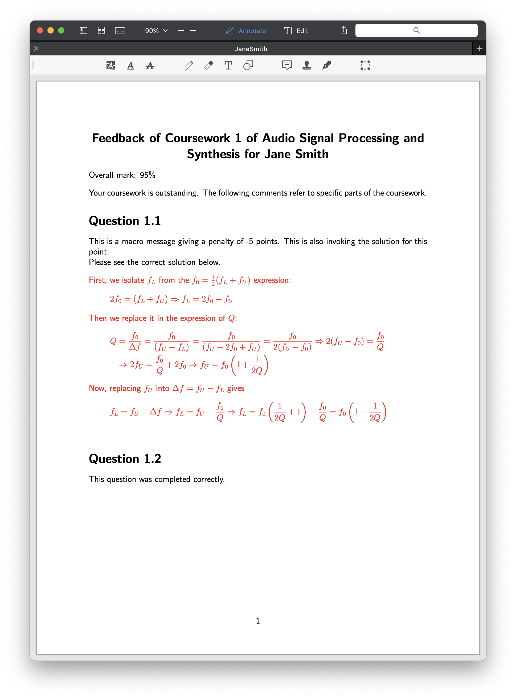
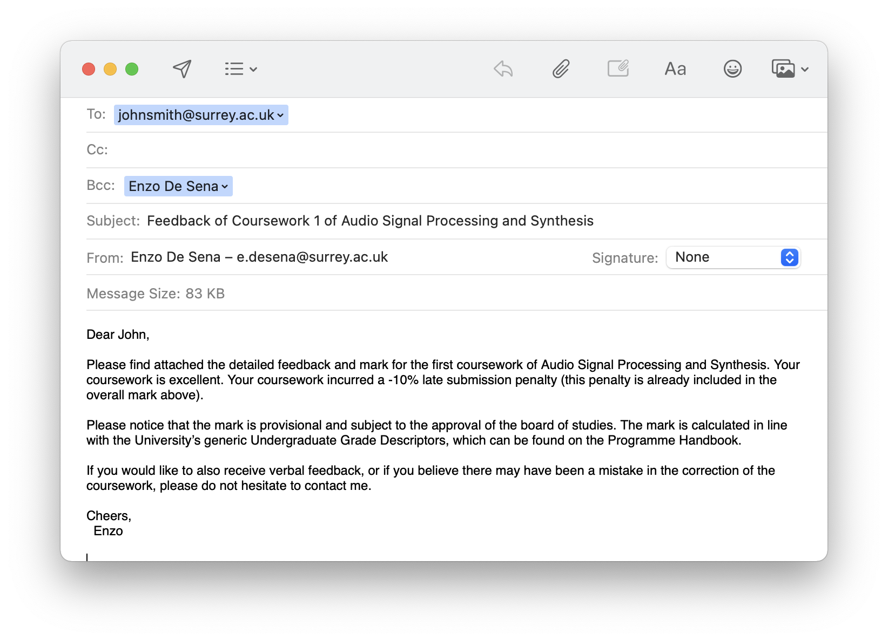
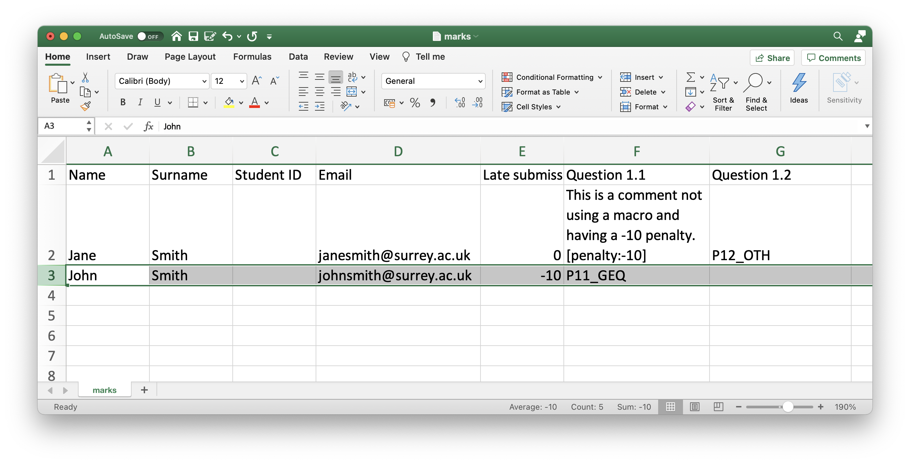

# Marking Toolbox

This toolbox represents my peak OCD for perfectly formatted and no-time-wasted feedback for student coursework/exams. The toolbox runs on Excel and Matlab (yes..). The PDFs are generated in the background using Latex.

You input the marks and comments via a tab-separated text file on Excel. Then, through Matlab you will parse that file, generate PDFs, and automatically send emails to students with the PDF as attachment.

The toolbox works on the assumption that you mark based on a **penalty scheme**, i.e. you start from a maximum possible mark and then remove marks based on how the student performed on individual questions. 

### Example of the PDF output


### Example of email to student with attachment


### Example of Excel spreadsheet that produced the PDF and email above
Highlighted is the relevant row. The macros ```P11_GEQ``` and ```P12_OTH``` are contained in a separate file. 



## Getting Started

These instructions will get you a copy of the project up and running on your machine.

### Prerequisites

You need Matlab and Latex. The automatic email sender works through an AppleScript, so it only runs on Mac. 

### Installing

Run on the Matlab console ```addpath your-path-to/marking-toolbox/src``` and you are ready to go! This only needs to be done once. 


### How to use


* Edit the ```coursework_variables.m``` as necessary by including e.g. macros for recurring mistakes. 
* Edit the Excel spreadsheet to include your marks and comments. To do this you need to open the file ```marks.txt``` with Excel (right-click on file, then "Open With", and then "Microsoft Excel"). Each row represents one student. Each column represent a different question. The content of the first row for each column will be the title section for the feedback. 
  * Within each cell you can add a macro, e.g. ```P11_GEQ``` as viewed in the example above, or add a numerical penalty to the question using the syntax "[penalty:-XX]". A negative number will **subtract** from the overall mark. You can also include a positive penalty, using the syntax "[penalty:+XX]". This penalty syntax will be removed from the final files (if you so wish). 
  * You can invoke a solution via the syntax "[solution]". When seeing this tag, the toolbox will look into the subdirectory ```solution_tex``` and a Tex file with the same name as the Question (i.e. first row).  
* Next you run on Matlab:
  * On the Matlab console, run ```mt_run_parsing('coursework_variables.m')```. This will generate a new tab-separated Excel file containing the final marks in "outputs/\_parsed_marks.txt". I suggest you look at this file to check the level of marks is as you expected. If you need to rescale them, you can change the relative settings in "coursework_variables.m" (see that file for a more detailed explanation), and then rerun ```mt_run_feedback('coursework_variables.m')```.
  * On the Matlab console, run ```mt_run_feedback('coursework_variables.m')```. This will generate the PDF files for each student using latex.
  * On the Matlab console, run ```mt_send_emails('coursework_variables.m')```. This will open Mail ready for you to hit "Send" and you are done!


**My advice to get started is to try the example included in "marking-toolbox/example" and run the ```mt_run_feedback```, ```mt_run_parsing``` and ```mt_send_emails``` as above.**

## Contributing

Pull requests are welcome.

## Authors

* **Enzo De Sena** - [desena.org](https://www.desena.org) (enzodesena AT gmail DOT com)


## License

This project is licensed under the MIT License.

